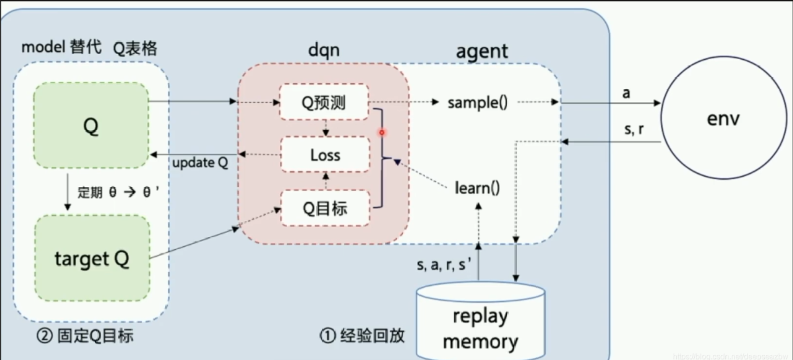

# DQN-VizdoomBasic-v1

## 状态空间和动作空间

obs:(240,320,3)

action:(4):0:idle,1:shoot,2:right,3:left

reward:射中+100 射偏-6 否则-1

## 网络

obs->CNN->(84,84,1)

每隔target_update步target_net拷贝policy_net的参数

每次更新：
- q=policy_net(obs)
- target=$r+\gamma*max_a target\_net(obs\_next)$
- loss=Huber Loss(q,target)

obs_next和obs对直接通过buffer离线获取

### Huber Loss

$$
\text{loss}(x) = 
\begin{cases}
0.5 \times \dfrac{x^2}{\beta} & \text{if } |x| \leq \beta \\[10pt]
|x| - 0.5 \times \beta & \text{if } |x| > \beta
\end{cases}
$$
